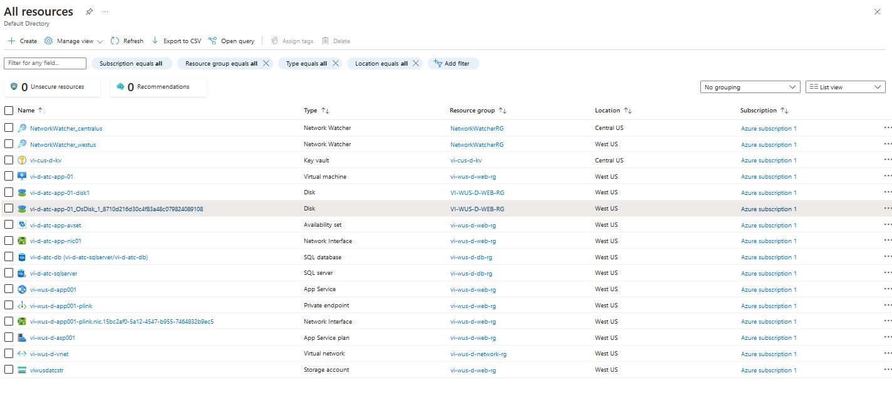

# Challenge-1 : 3 Tier environment deployment to Azure using terraform

## Requirements (In Windows Machine)
``Terraform Version`` Terraform v1.4.6  
``Azure CLI`` Latest Azure CLI

## Folder Structure
Root of the folder contains main deployment files.

**modules** - Individual modules for each resource type to keep resources standard accross organization.

**environments** - This folder contains environment specific ``tfvars`` file to provide as input for terraform execution.

## Steps to execute terraform deployment:
**Login to Azure** ``az login``  
**Select Azure Subscription** ``az account set -s "subscription_id"``  
**Terraform Initialize** ``terraform init``  
**Terraform Plan**   For DEV environment ``terraform plan -var-file="./environments/wus-dev.tfvars"``  
                    For QA environment ``terraform plan -var-file="./environments/wus-qa.tfvars"``  
**Terraform Apply**   For DEV environment ``terraform apply -var-file="./environments/wus-dev.tfvars"``  
                    For QA environment ``terraform apply -var-file="./environments/wus-qa.tfvars"``  

This terraform is designed for a single application with app serivces as front end, VM in application tier and Azure SQL in database tier.

**Re-usability:** Single main.tf file with environment specific inputs are managed through respective ``tfvars`` file makes this terraform template highly reusable and also maintain same standards accross environments.

**Resources deployed In Azure**  
